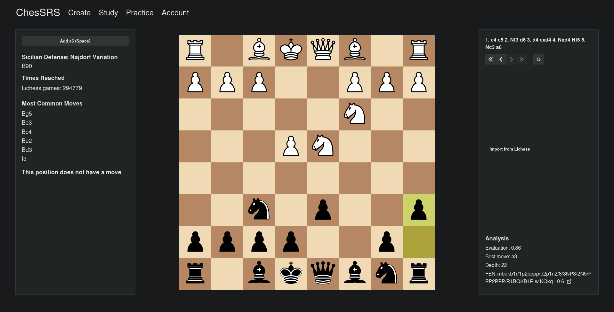
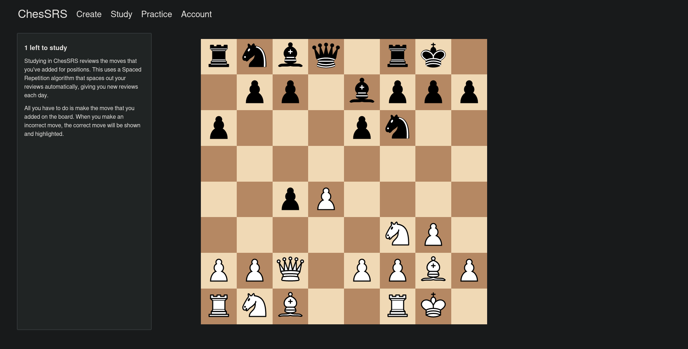

# ChesSRS

Learn chess openings using spaced repetition

### Create Your Own Lines

### Study Your Repetoire

## Deployment
To run on your own machine:
- Install NGINX and Docker
- Run `bash build.sh` to build the frontend and backend and containerize them
- Run `bash start.sh` to start the docker container and an NGINX reverse proxy
- Visit `http://localhost`

## Features

- Import games from Lichess
- In-browser engine analysis
- Configurable spaced repetition
- Export moves to JSON

### Work in Progress

- Import studies from Lichess

